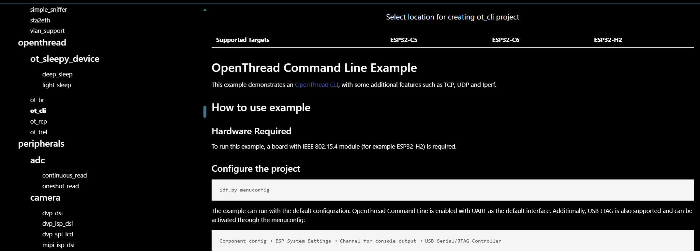
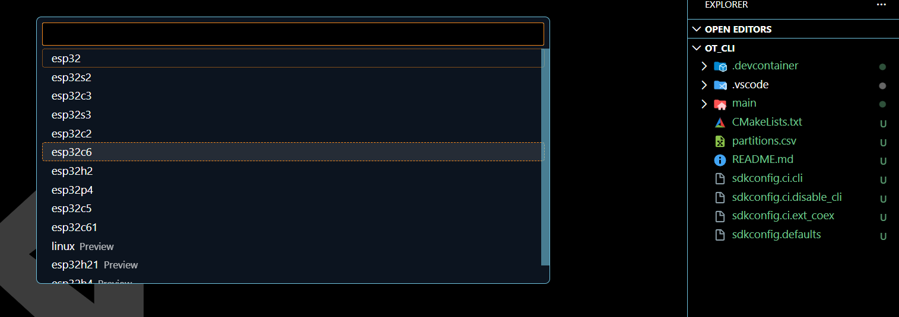
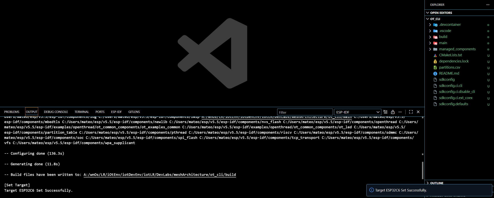
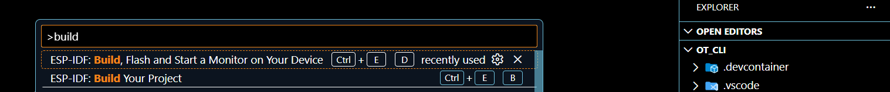

# mesh architecture assignment

## select project :

We choose ot_cli because it gives us an interactive console. This way you can see how one node creates the network and another joins, fulfilling the "Mesh" requirement.

## set espressif device

inside of the project directory , we select the specific device for this assignment _esp32c6_

### esp32c6 selected

## manage ESP source code

- **esp source code** → [`esp source`](./ot_cli/main/esp_ot_cli.c)

### build , flash and monitor

finally, build project, flash and monitor device.

### Implementing the Mesh Architecture (The Test)

To demonstrate a mesh, you ideally need two ESP32-C6 cards.  
If you only have one, you can prove that you create the network (Leader), but there will be no one to talk to.

---

### Node A (Mesh Leader)

In the serial monitor, type these commands one by one:

- `dataset init new`  
  _(Creates a new operational network configuration.)_

- `dataset commit active`  
  _(Save that setting as the active one.)_

- `ifconfig up`  
  _(Turn on the IPv6 network interface.)_

- `thread start`  
  _(Begins the Mesh protocol.)_

- `state`  
  _(Should answer **leader** after a few seconds.)_

---

### Node B (Router / End Device Joining)

You need the **Master Key** of Node A to join.

1. On Node A, write:  
   `dataset activekey`  
   Copy the hex string that comes out.

2. On Node B, write:
   dataset activekey <COPY-KEY> ifconfig up thread star

3. Wait a few seconds, then type:  
   `state`  
   _(Should answer **child** or **router**.)_

---

### Verify Communication (Ping in Mesh)

1. On Node B, write:  
   `ipaddr`  
   Copy the address that begins with **fd...** (that's the Local Mesh IP).

2. On Node A, write:  
   `ping <DIRECCION_IP_DEL_NODO_B>`

if we see a response.  
we've built a Mesh architecture on top of **802.15.4 using ESP32-C6**.
