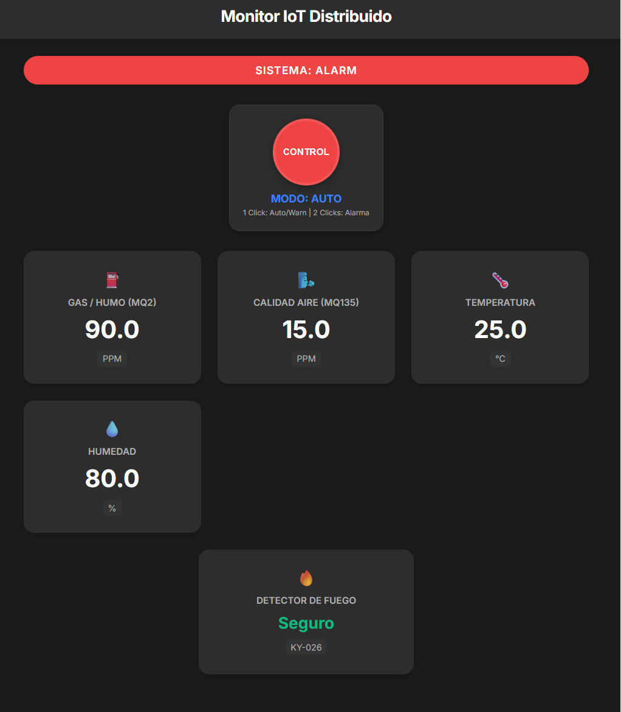
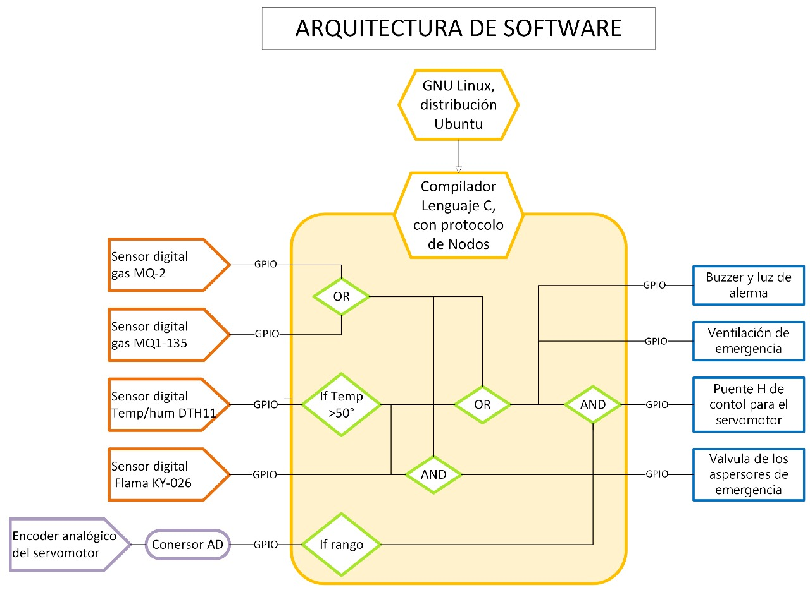
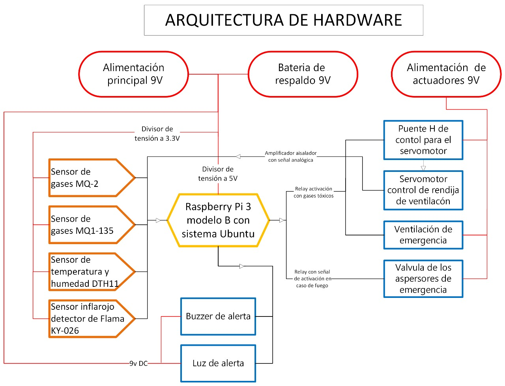
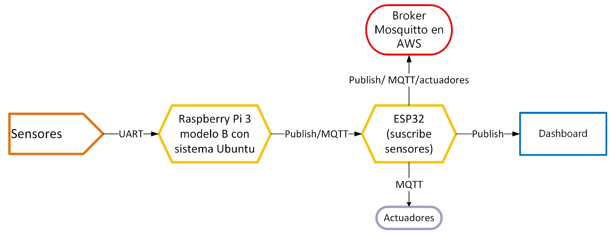

# WeatherShield – Embedded Linux Capstone



## Intelligent Edge Weather & Security System based on Raspberry Pi 3

_Estación meteorológica inteligente y sistema de seguridad perimetral_  
Diseñada para **monitorear variables ambientales, detectar humo y movimiento**, y **responder automáticamente** con alertas y actuadores en un **invernadero urbano**.  
Desarrollada en el marco del curso **Linux Services in Embedded Systems**, guiado por el **Prof. Juan Bernardo Gómez-Mendoza (UNAL 2025-2)**.


---

## Descripción general

WeatherShield es una **plataforma IoT embebida** basada en **servicios Linux (systemd)** que combina:

- **Sensado ambiental:** temperatura, humedad, presión, luminosidad y gases.
- **Seguridad activa:** detección de humo e intrusión con sirena/alertas.
- **Procesamiento local:** almacenamiento y lógica en buffer SQLite.
- **Conectividad MQTT:** publicación de telemetría hacia la nube o red local.
- **Automatización:** reglas configurables para activar actuadores.
- **Resiliencia energética:** operación autónoma ≥ 12 h mediante UPS HAT + batería.

El sistema sigue una arquitectura **Edge → Cloud**, con un nodo Raspberry Pi que actúa como dispositivo de borde y un backend que recibe datos, los almacena y los visualiza mediante un dashboard React/Plotly, haciendo uso de la arquitectura EDGE GATEWAY.

---

## Estructura del proyecto

```
WeatherShieldProject/
│
├── design/
│ └── prjDesign.md # Bitácora de diseño y diagramas HW/SW
│
├── docs/ # Documentación técnica y de verificación
├─────design/
│ ├─── └── capstone-rubric.pdf # Rúbrica original y documentos de diseño
│ ├──  └──  verification-plan.md # Estrategia de pruebas unitarias e integración
│ ├──  └── risk-register.md # Riesgos y planes de mitigación
│ ├── README.md # Guía general de trabajo y rúbrica
│ ├────requirements/
│ ├──  └── requirementsDesign.pdf # rúbcria de entrega
│ ├──  └── requirements.md # Problema, alcance, FR/NFR e interfaces
│ └── ...
│
├── hardware/
│ └── bom.md # Lista de materiales y estado de adquisición
│ └── mapPin.md # lista de pines usados en la raspberry pi
├── tests/
│ ├── unit/ # Pruebas unitarias (pytest)
│ ├── integration/ # Pruebas HIL (Hardware-in-the-loop)
│ ├── evidence/ # Resultados, logs y capturas
│ └── README.md
│

│
└── README.md # Este documento
```

### Diagramas de estructura

#### Software



#### Hardware



#### Communication



---

## Objetivos del proyecto

| Tipo             | Objetivo                                                                                                                | Indicador / Métrica                               |
| ---------------- | ----------------------------------------------------------------------------------------------------------------------- | ------------------------------------------------- |
| **General**      | Desarrollar una estación meteorológica embebida con servicios Linux que combine monitoreo ambiental y seguridad activa. | Prototipo funcional 100 % operativo en 8 semanas. |
| **Específico 1** | Medir variables ambientales (T, HR, P, Lux) y gases.                                                                    | Precisión ± 1 °C, ± 2 % HR, muestreo 60 s.        |
| **Específico 2** | Detectar humo o movimiento y activar alarmas en tiempo real.                                                            | Tiempo de alerta < 30 s.                          |
| **Específico 3** | Almacenar localmente ≥ 48 h de datos y sincronizar vía MQTT.                                                            | 0 % pérdida en reconexión.                        |
| **Específico 4** | Implementar motor de reglas y control remoto de actuadores.                                                             | Reglas configurables vía API/dashboard.           |
| **Específico 5** | Asegurar autonomía energética ≥ 12 h.                                                                                   | Validación IT-06.                                 |
| **Específico 6** | Cumplir la rúbrica de verificación (coverage ≥ 70 %).                                                                   | Evidencias IT-01..IT-07 documentadas.             |

---

## Objetivos de entrega según rúbrica

1. **Problema y requisitos (20 %)** – Motivación clara, arquitectura completa y requisitos medibles.
2. **Plan de verificación (20 %)** – Automatización de pruebas unitarias y cobertura ≥ 70 %.
3. **Pruebas de integración (40 %)** – Casos HIL documentados con resultados verificables.
4. **Documentación final (20 %)** – README, guías de usuario y despliegue, changelog y demo final.

- **requirements** → [`requirements `](./docs/requirements/)
- **hardware** → [`BOM`](./hardware/bom.md)
- **software** → [`software`](./software)

---

## Roadmap de desarrollo (8 semanas)

| Semana  | Foco principal                                            | Resultados esperados                                          |
| ------- | --------------------------------------------------------- | ------------------------------------------------------------- |
| **1–2** | Validar requisitos, cerrar BOM y configurar entorno + CI. | Repositorio base, `weather-node.service` y drivers digitales. |
| **3–4** | Telemetría digital + buffer + dashboard básico.           | Publicación MQTT y dashboard mínimo viable.                   |
| **5–6** | Integrar sensores analógicos y motor de reglas.           | Activación automática de actuadores + alertas.                |
| **7**   | Pruebas de seguridad.                                     | TLS y ACL en MQTT.                                            |
| **8**   | Pruebas en campo y documentación final.                   | Demo, reporte y evidencias completas.                         |

> Consulta `docs/roadmap.md` para el desglose completo de tareas e hitos.

---

## Próximas acciones inmediatas

- [x] Validar métricas de éxito con el stakeholder (Semana 1).
- [x] Confirmar disponibilidad del hardware pendiente y actualizar `hardware/bom.md`.
- [x] Configurar pipeline y verificar servicios y comunicación entre nodos.
- [x] Prototipar lectura de sensores lgpio/BME280/BH1750/DS18B20 y comunicación con MQTT/... .
- [x] Documentar el flujo MQTT y reglas iniciales en `docs/verification-plan.md`.

---

## Recursos de apoyo

- Rúbrica oficial → `advances/capstone-rubric.pdf`
- Diagramas de hardware/software → `diagramas'
- Guías de verificación y trazabilidad → `docs/design/verification-plan.md` y `docs/design/risk-register.md`

---

## Autores

**Mateo Almeida (Macreat)**

**Fabian de Jesus Perez Salazar**

Estudiantes – Universidad Nacional de Colombia

Curso: _Linux Services in Embedded Systems_ – 2025-2

GitHub: [@Macreat](https://github.com/Macreat)

GitHub: [@FabianDJPerez](https://github.com/FabianDJPerez)

---

## Licencia

Uso académico y de aprendizaje.

© Universidad Nacional de Colombia.
